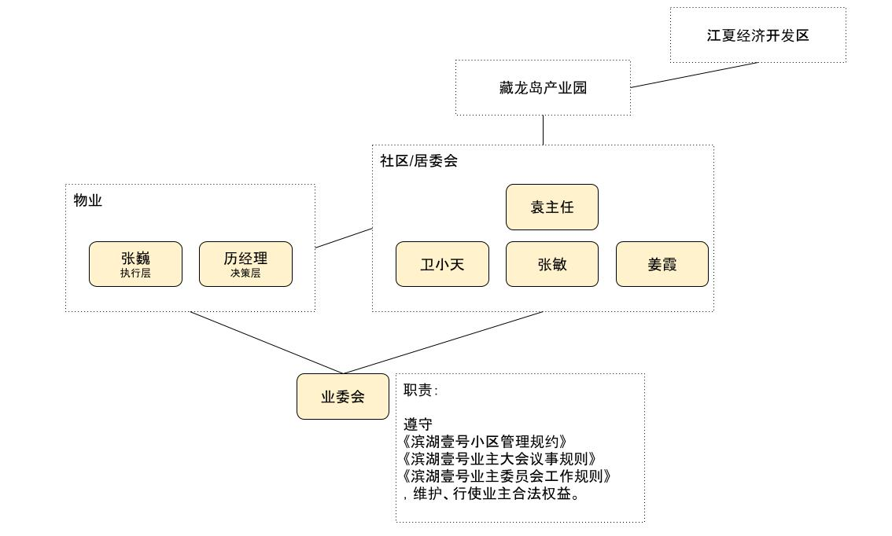

# 滨湖壹号业委会

## 愿景

将我们小区打造成一个安居乐业的小区。

### 策略

- 信息化，让沟通变得高效
- 安全第一，安居才能乐业

### 原则

- 业委会决策需成员全票（5票）通过
- 业委会成员不拿工资
- 业委会所有资源对外开放，支持并鼓励热心业主为小区做积极贡献
- 固定月会时间，并对所有人开放 （每月第一周周日晚）

**微信群沟通原则**

- 回答群名已修改为名字加房号的业主提问
- 鼓励讨论，对事不对人
- 对有人生攻击及造谣的记录截屏保存，并列入沟通黑名单


## 成员

- 刘莹莹
- 陶佳奇
- 吴尽
- 张露
- 孙伟

<--->

## 微信群楼栋负责人

- 陶佳奇：1栋1单元
- 刘莹莹：1栋2单元
- 孙伟：  2栋1单元
- 吴尽：  2栋2单元
- 张露：  20栋



### 职责及工作方式

