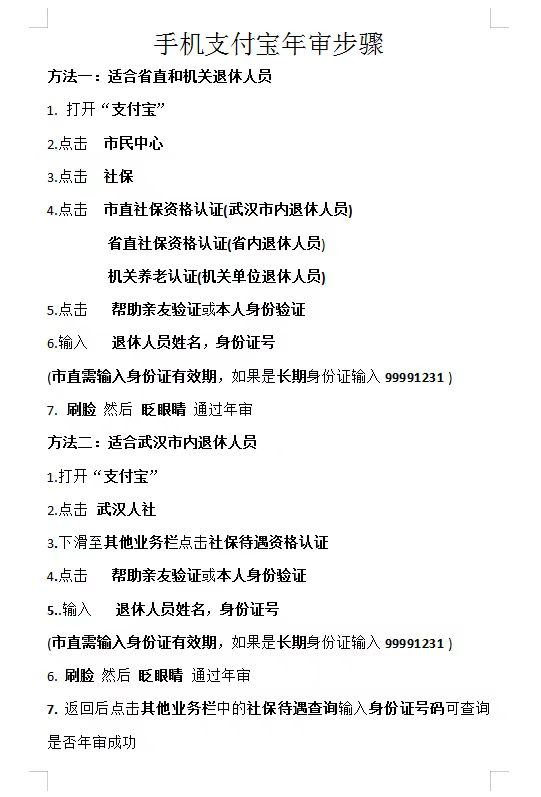

# 退休年审

2024年度退休职工待遇年审工作开始了！！

为更好的服务居民，我社区拟在小区进行“退休职工待遇年审”，请需要年审的居民（仅限湖北省退休人员）**本人**携带身份证件前来年审（身份证、户口簿或老年证任一即可）。

## 所需材料

身份证、户口簿或老年证任一即可

## 时间

3月14日本周四下午15：00—16：30

## 地点

银河湾小区篮球场（正一幼儿园旁）

### 支付宝年审步骤

