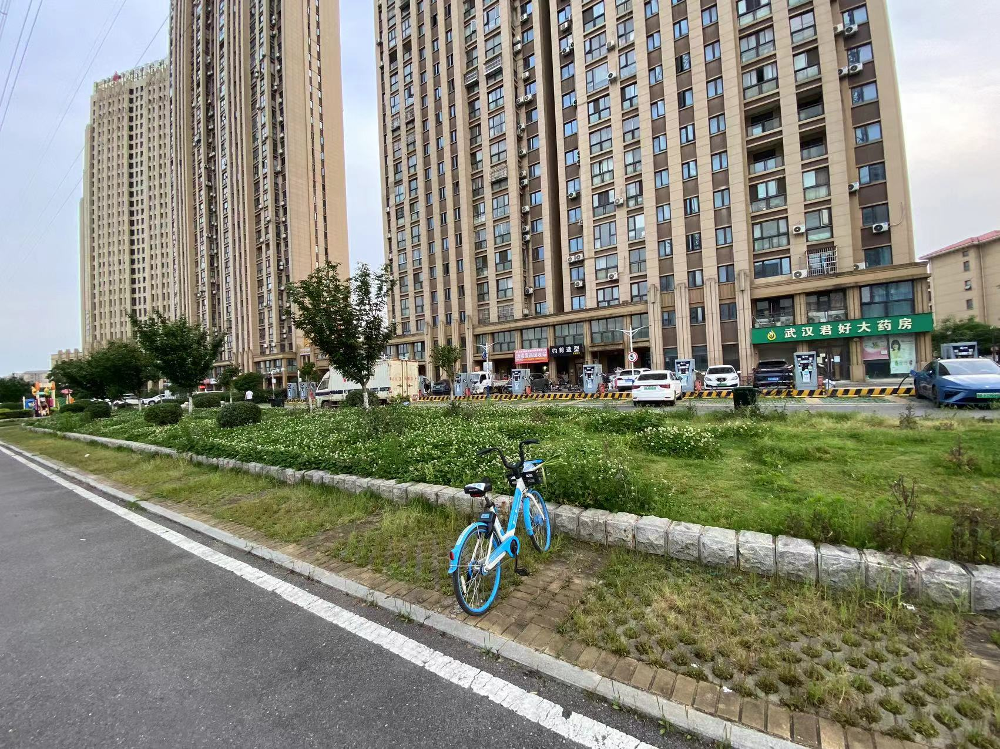
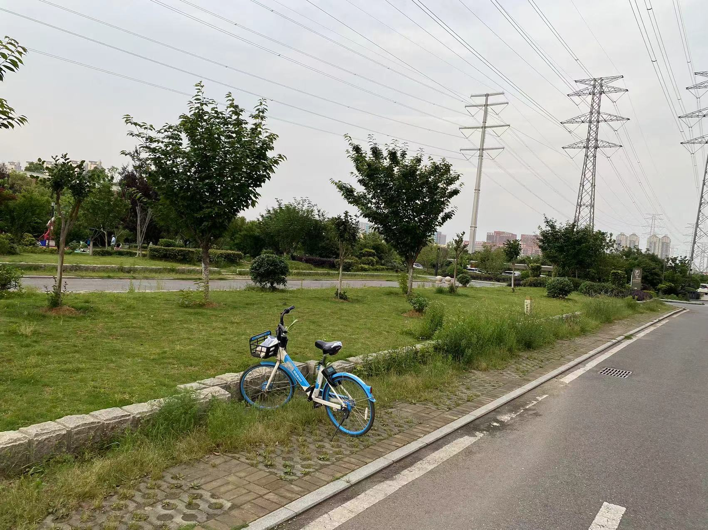
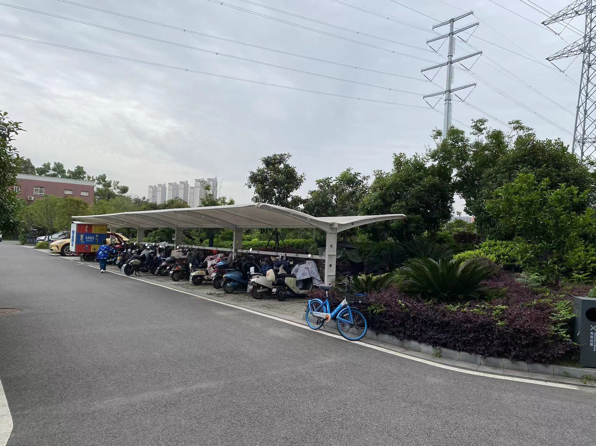
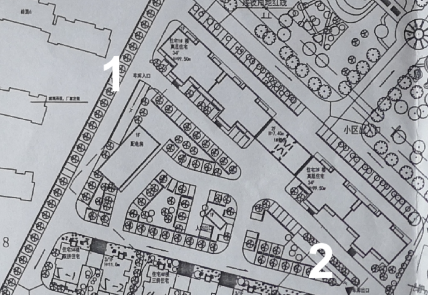

# 计划步骤

1. 重新选址，征集方案。（已完成）
2. 方案投票，[投票链接](https://jinshuju.net/f/civIE4)（已完成 [投票结果](https://binhu.store/posts/00007/)）
   - 方案投票占比：方案一 ： 方案二 = 61.3% ： 38.7%
3. 对接物业，确认实施方案 （进行中）
   - 备案（已确认）
         - 和物业历经理确认过项目流程后，被告知需要和消防部门沟通备案相关事宜
         - 和社区确认完备案事宜后，得知消防部门说无需备案，需要注意安全隐患
   - 经济（供应商服务，价格对比）
   - 车位数量信息统计，我们小区现有电动车，近300辆。现有充电口近100个。（周未人工智能数数得出）
     - 20栋楼前有78辆电动车
     - 一，二栋前后有218辆（包含充电位、安全通道、散停车辆）

## 方案

方案选取原则建议：

* 公平（保证电动车位定向供应，像20栋一样，一栋，二栋也都有标配的位置。 因为有业主反馈不想把所有的电动车都停在自己楼栋前）
* 安全（离楼栋有一定距离）
* 节约（小区面积有限，最好不要占用汽车车位）

以下方案均由业主推荐。

## 选址方案一

## 选址方案二

拓展车位

### 【不做推荐】

备选方案

